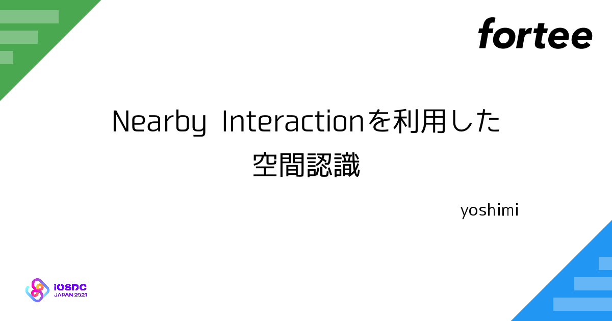

今年の4月、Apple製の紛失防止タグ「AirTag」が発売されました。
AirTagはUWB（超広帯域無線通信）技術が使われていて、高い精度で位置を検知することができます。
このUWB技術を使った空間認識を開発者でも使えるようにするフレームワーク Nearby Interaction について紹介したいと思います。

* Nearby Interaction フレームワークの使い方
* Nearby Interaction フレームワークの使用例
* Nearby Interactionがサードパーティ製アクセサリをサポート（iOS15~）

https://speakerdeck.com/yoshimin/nearby-interactionwoli-yong-sitakong-jian-ren-shi
